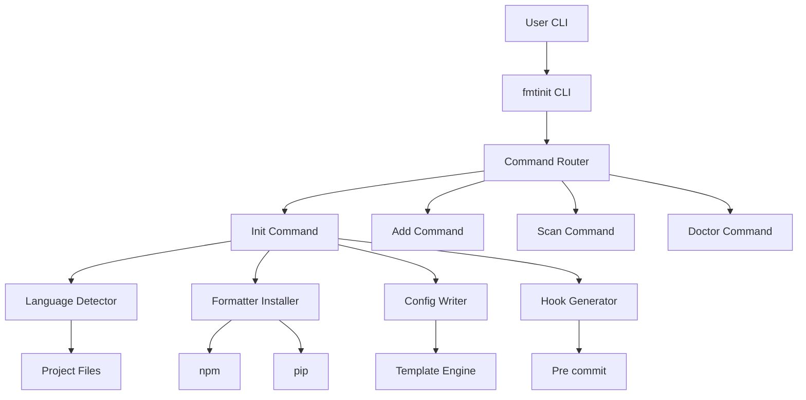

# fmtinit


## Overview

`fmtinit` is a CLI tool that sets up code formatters and pre-commit hooks
for your project in a single command — no manual configuration needed.

It detects the programming languages in your project, installs the right
formatters (Prettier, Black, Ruff, and more), and generates all the config
files automatically. Whether you're starting a new project or standardizing
an existing one, `fmtinit` gets your formatting stack ready in seconds.

Built for solo developers and teams working on multi-language repositories.

## Features

- **Automatic Language Detection** — scans your project and identifies
  which languages are in use
- **Formatter Installation** — installs the right tools for each language
  (Prettier for JS/TS, Black + Ruff for Python, dart format for Dart)
- **Config File Generation** — creates `.editorconfig`, `.prettierrc.json`,
  and `pyproject.toml` sections automatically
- **Pre-commit Hook Setup** — wires formatters into `.pre-commit-config.yaml`
  so formatting runs on every commit
- **Incremental Language Support** — add a new language to an existing setup
  with `fmtinit add <language>` without touching anything else
- **Doctor Command** — diagnoses missing or broken formatter configurations
  and tells you exactly what to fix

## Tech Stack

| Layer          | Technology                               |
| :------------- | :--------------------------------------- |
| CLI Framework  | Python (Typer, Rich)                     |
| Core Logic     | Python                                   |
| Package Mgmt   | Python (pip, setuptools), JavaScript (npm) |
| Formatting     | Black, Ruff, Prettier                    |
| Configuration  | YAML, TOML, JSON, INI                    |
| CI/CD          | GitHub Actions                           |

## Project Structure

```
fmtinit-formatter/
├── fmtinit/
│   ├── src/
│   │   ├── fmtinit/
│   │   ├── commands/
│   │   │   ├── __init__.py
│   │   │   ├── add.py
│   │   │   ├── doctor.py
│   │   │   ├── init.py
│   │   │   └── scan.py
│   │   ├── core/
│   │   │   ├── __init__.py
│   │   │   ├── detector.py
│   │   │   ├── hooks.py
│   │   │   ├── installer.py
│   │   │   ├── profiles.py
│   │   │   ├── state.py
│   │   │   └── writer.py
│   │   ├── templates/
│   │   │   ├── editorconfig.tpl
│   │   │   ├── precommit.yaml.tpl
│   │   │   └── prettier.json.tpl
│   │   ├── __init__.py
│   │   ├── cli.py
│   │   └── main.py
│   ├── tests/
│   │   ├── __init__.py
│   │   ├── conftest.py
│   │   ├── test_cli.py
│   │   ├── test_detector.py
│   │   ├── test_hooks.py
│   │   ├── test_profiles.py
│   │   └── test_writer.py
│   ├── .gitignore
│   ├── CHANGELOG.md
│   ├── LICENSE
│   ├── pyproject.toml
│   └── README.md
├── package-lock.json
└── package.json
```

## Getting Started

### Prerequisites

*   Python 3.11 or higher
*   pip (Python package installer)
*   npm (Node.js package manager, for JavaScript/TypeScript projects)
*   git (for pre-commit hooks)

### Installation

1.  **Clone the repository:**
    ```bash
    git clone https://github.com/hakaninki/fmtinit-formatter.git
    cd fmtinit-formatter/fmtinit
    ```

2.  **Install the package:**
    ```bash
    pip install .
    ```
    For development, install with dev dependencies:
    ```bash
    pip install ".[dev]"
    ```

### Environment Setup

No specific environment variables are required for basic operation. `fmtinit` primarily interacts with local project files and system-wide package managers.

## Usage

### Initializing a Project

To set up formatting for a new or existing project, navigate to the project root and run:

```bash
fmtinit init --langs
```

This command will:
1.  Detect languages in your project.
2.  Suggest and install relevant formatters (e.g., `prettier` via `npm`, `black` via `pip`).
3.  Generate configuration files (`.editorconfig`, `.prettierrc.json`, `pyproject.toml` sections).
4.  Set up `pre-commit` hooks.

### Adding Language Support

If you add new languages to your project later, you can update the formatting setup:

```bash
fmtinit add <language>
# Example: fmtinit add javascript
```

### Detect languages in your project

To scan your project for formatting issues without fixing them:

```bash
fmtinit scan
```

### Scanning for Issues

To check the health of your formatting setup and identify potential problems:

```bash
fmtinit doctor
```

### For Help

```bash
fmtinit --help
``` 

## API Reference

This project is a CLI tool and does not expose a public API in the traditional sense. Its interface is through the command-line arguments and options.

## Architecture



## Contributing

We welcome contributions! Please follow these steps:

1.  Fork the repository.
2.  Create a new branch for your feature or bug fix.
3.  Make your changes and ensure tests pass.
4.  Write clear, concise commit messages.
5.  Submit a pull request.

## License

This project is licensed under the MIT License - see the [LICENSE](LICENSE) file for details.
